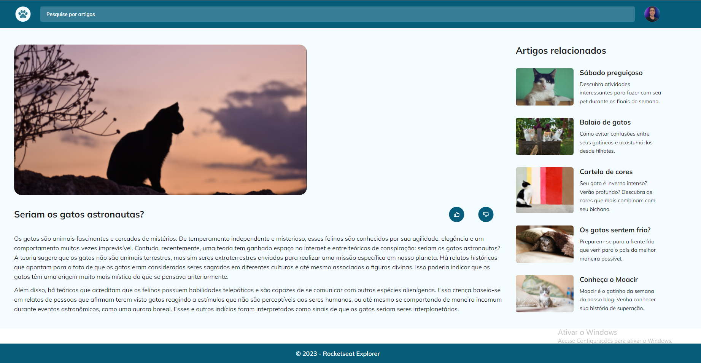

# Desafio do Stage 03 - Blog de gatos 

"Blog de Gatos", um projeto de onde aplicamos responsividade e propriedades no css como posicionamento de elemento com o grid.

> Stage 03 - Avançando no Html e Css

Neste modulo aprendimos conceitos de responsividade,fundamentos de  grid no codigo e formularios, alinhamentos e animações dentro das landing pages assim como a alteração de cores em HSL para facilitar a manutenção de codigo nas proximas atualizações do projeto 

👉🏼[Link do projeto](https://blog-de-gatos-mb.vercel.app/)

## 🔗 Tecnologias Usadas

## 🔗 Deploy 

## 🔗 Meu Contato

## 🚀 Sobre mim
 Estudante de Engenharia de Software na UNOPAR e 
 Desenvolvedor Full Stack estudando na Rocketseat dentro do Programa Explorer 
